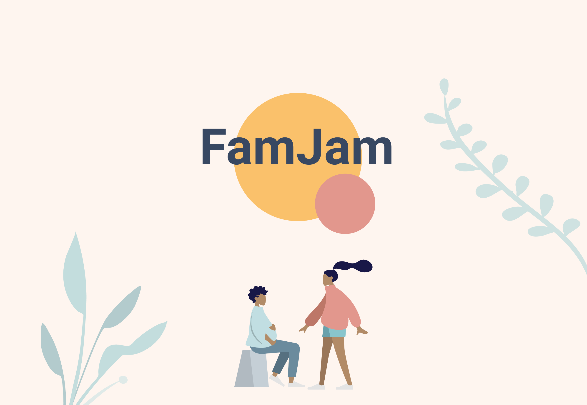
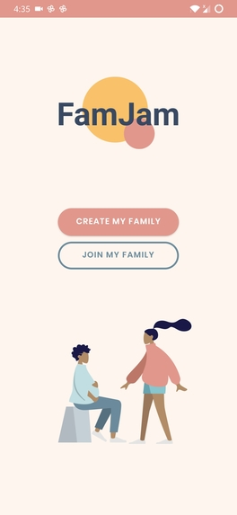
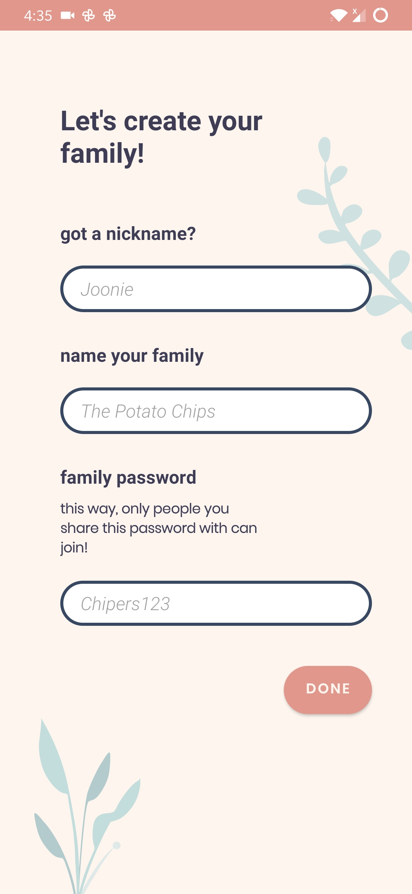
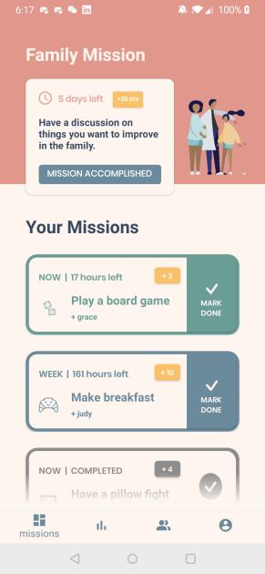
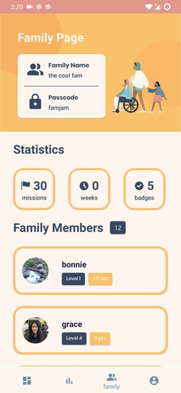
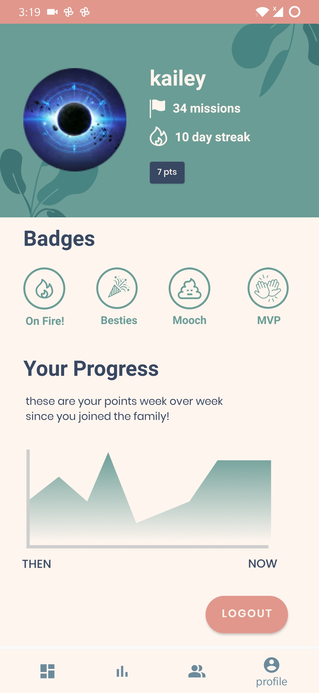
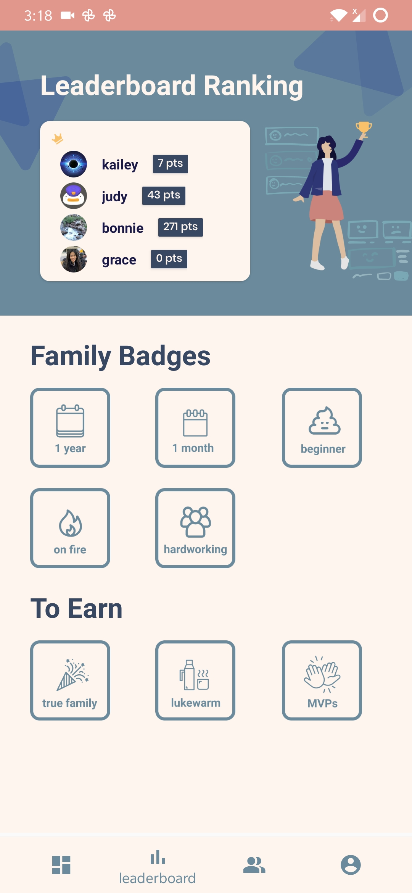

### About
FamJam is an Android app that helps families, roommates - **anyone who lives together**, to **get to know each other in a fun way.** Every “family member” will receive two daily missions and one mission weekly. The first daily mission will be sent in the morning while the second will appear at a **random time** for you to rack up bonus points, encourage you to put family first and of course to see you scramble. Every mission involves **brightening up someone's day** or doing something to get to **know another member better.** For example, your mission of the day might be to give your mom a hug! The weekly mission will involve the entire “family”, with anything from playing soccer together to having a **profound discussion about what family means to them.**

**1st Place at Hack the Cloud**

### Technologies
- Android Studio
- Java
- Android XML
- Firebase Real-time Database
- Google Authentication

### Quick Preview
Here's a glance at how it looks:  

### Contributing
Please feel free report bugs and add any ideas you like!
